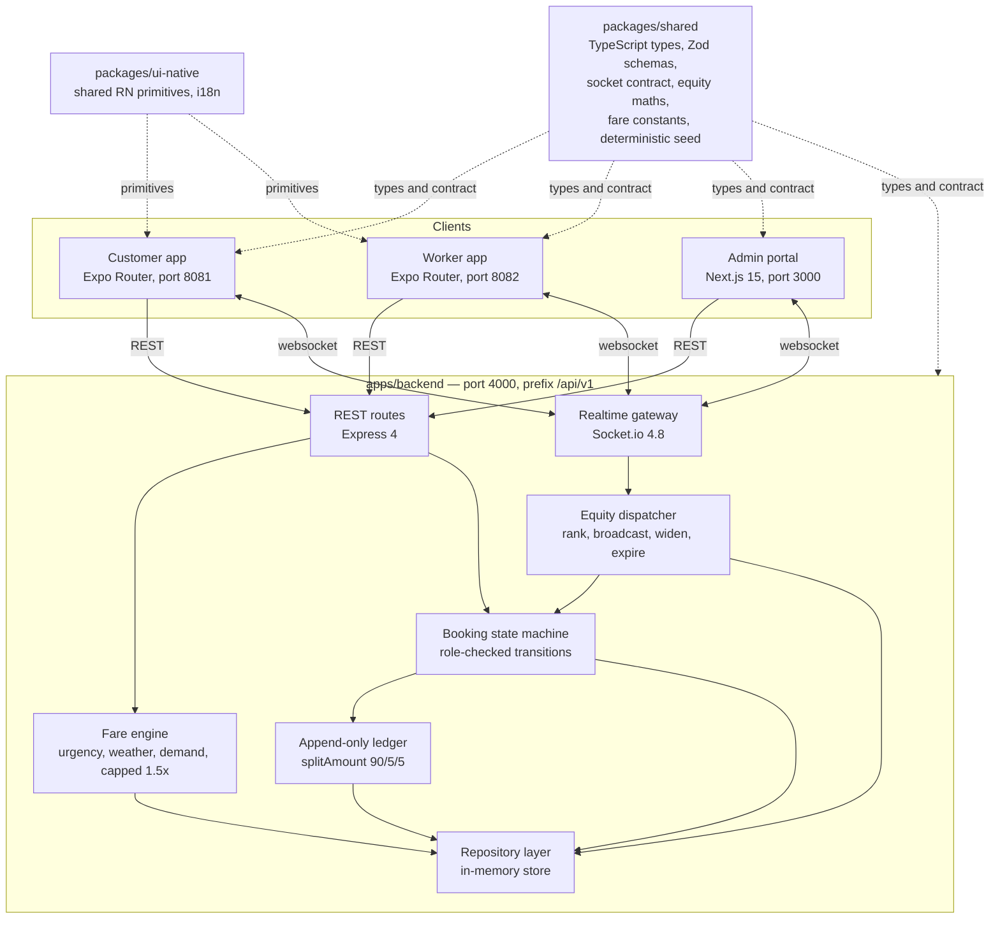
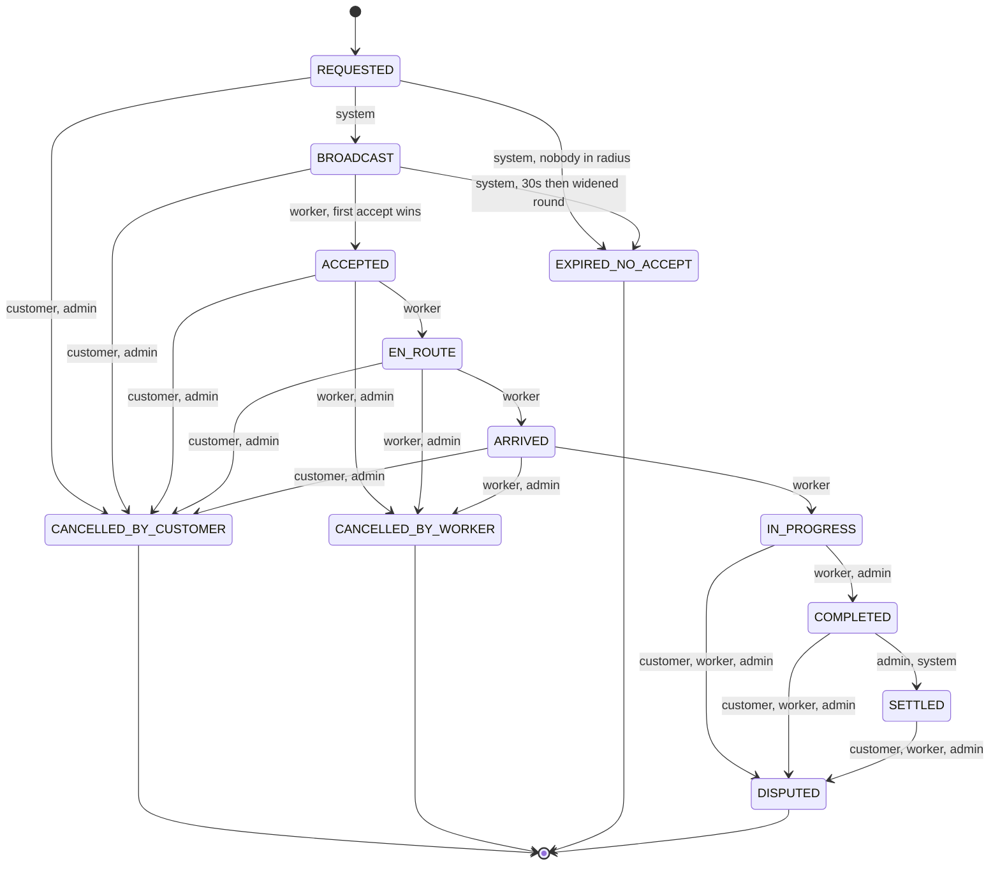

<div align="center">


# Sahayo

### Cooperative gig services platform for household and community services

**Turning on-demand gig work into worker-owned enterprise.**

[](https://www.sih.gov.in/)
[](https://www.sih.gov.in/)
[](https://cooperation.gov.in/)

[](https://www.typescriptlang.org/)
[](https://nextjs.org/)
[](https://expo.dev/)
[](https://reactnative.dev/)
[](https://pnpm.io/workspaces)
[](https://turborepo.com/)
[](LICENSE)

</div>

---

## Submission details

| | |
| --- | --- |
| **Problem Statement ID** | SIH26089 |
| **Problem Statement Title** | Cooperative Gig Services Platform for Household & Community Services |
| **Organisation / Ministry** | Ministry of Cooperation |
| **Theme** | Agriculture, FoodTech & Rural Development |
| **Category** | Software |
| **Team name** | Innovex |

---

## The pitch

Household services in India are brokered by aggregators that take 20–30% of every
job and decide who gets offered work. Dispatch runs on proximity and rating, so
income concentrates: the worker nearest affluent demand with the earliest good
reviews is offered more, earns more, stays online more, and pulls further ahead.
Everyone else absorbs the idle hours. Workers hold no equity, no safety net, and
no vote on the rules they work under. Customers, meanwhile, struggle to find help
that is verified and transparently priced.

Sahayo keeps the on-demand experience and changes who owns it. Workers are
members of a cooperative and keep **90%** of the job price. Dispatch weights the
least-worked member *up*, so work spreads instead of concentrating. **5%** of
every settled job funds a member-governed welfare fund — paid out of the
platform's share, so the customer's price is unchanged. The cooperative structure
is in the arithmetic and the dispatch algorithm, not in the marketing copy.

---

## What makes it cooperative

### The fare split — 90 / 5 / 5

Defined once in [`packages/shared/src/constants.ts`](packages/shared/src/constants.ts)
as `WORKER_SHARE`, `PLATFORM_SHARE` and `COOP_FUND_SHARE`, asserted to sum to 1 at
module load, and imported by the backend, the admin portal and both mobile apps.
No app writes the numbers as literals, so the portal cannot show a worker a
different figure than their phone does.

Money is integer **paise** everywhere and formatted only at the render edge.
[`splitAmount()`](packages/shared/src/seed/ledger.ts) computes the worker and
platform shares and assigns the **rounding remainder to the cooperative fund**
(`coopFund = gross - worker - platform`), rather than rounding all three
independently. That is what makes every period's three figures sum exactly to
the gross, to the paisa.

GST at 18% is added on top of the item price and is never split — it is collected
and remitted, not revenue to divide.

### Equity-ranked dispatch

One scoring function, `computeEquityScore` in
[`packages/shared/src/equity.ts`](packages/shared/src/equity.ts), shared by the
backend dispatcher, the admin portal's Broadcast Inspector and the seed:

```
score = 0.30 x proximity          (1 at the customer's door, 0 at the radius edge)
      + 0.25 x rating             (0 at the 3.6 floor, 1 at a perfect 5)
      + 0.45 x inverseAllocation  (1 with no jobs this week, 0 for the busiest member)
```

**The third term is the point.** It carries the heaviest weight, so a member who
has taken few jobs this week is ranked up — which is how income is stopped from
concentrating in the hands of whoever is closest or best-reviewed. The backend
test suite asserts exactly this: *"a lower-rated worker with fewer jobs this week
outranks a saturated top-rated worker."*

A request is offered to the **top 5** candidates within **5 km**, simultaneously,
with a **30-second** countdown. The first accept wins and the rest receive
`TAKEN`; the server arbitrates, so five concurrent accepts still produce one
winner. If nobody accepts, the radius widens to **8 km** for one more round, then
the booking expires. Weights are administrator-adjustable from Settings, and a
change recomputes every member's stored score in the same write, with an audit row.

### An append-only ledger

No function in the codebase edits or deletes a ledger entry. A correction is a
**new** compensating row carrying `reversalOf`; the original stays byte-identical
forever. Status is *derived*, never stored — "released" means a `PAYOUT_RELEASE`
row exists pointing back at the original. A refund is four rows that net to zero:
the customer is credited R, and R is recovered from the worker, the platform and
the fund using the same `splitAmount` the booking was paid with, so a refunded
period still balances to the paisa. Balances are computed from the rows, never
cached in a mutable field.

### A member-governed welfare fund

Implemented: members read proposals and cast one recorded ballot each from the
worker app; `votesFor` / `votesAgainst` always equal the ballots counted by
direction; a second vote from the same member is refused rather than replacing
the first. Quorum is 60% of eligible members and is reported as *participation* —
a proposal can fail quorum with every vote cast in favour, and the UI says so
rather than reporting a rejection. Each passed programme produces a fund
disbursement for exactly the amount approved, dated just after its vote closed,
so every rupee spent traces to the decision that authorised it.

Prototype status: voting, ballots, quorum and disbursement traceability run on
seeded data. Micro-loan requests are captured in the worker app and appear in the
admin portal; disbursement approval is a seeded flow, not a live credit decision.

---

## Architecture

### Components



`packages/shared` is consumed as TypeScript **source** — no build step and no
`dist`. Next.js compiles it through `transpilePackages`, Metro resolves it through
the hoisted `node_modules`, and the backend runs it under `tsx`. Types and Zod
schemas are held in lockstep by a `satisfies z.ZodType<T>` assertion on every
schema, so drift is a compile error rather than a runtime surprise.

The repository layer is the single seam a real database swaps into. Every read and
write already goes through it, so a function body changes from "filter this array"
to "query this table" and nothing above it changes.

### Booking lifecycle

Transitions below are exactly those in
[`apps/backend/src/domain/booking-machine.ts`](apps/backend/src/domain/booking-machine.ts).
Roles in brackets are the only actors permitted to make each move; anything absent
from the table throws `IllegalTransitionError` naming both states.



Terminal states have no exit, and nothing moves backwards. `SETTLED` is reachable
only from `COMPLETED`, and posting the split is what `SETTLED` means.

### Monorepo layout

```
sahayo/
├── apps/
│   ├── backend/        Express 4 + Socket.io, TypeScript run under tsx.
│   │                   Fare engine, equity dispatcher, booking state machine,
│   │                   append-only ledger, in-memory repository layer.
│   ├── admin-web/      Next.js 15 App Router. Cooperative administrator portal:
│   │                   dashboard, live dispatch, bookings, workers, customers,
│   │                   KYC verification, finance, fund, disputes, analytics,
│   │                   settings. Offline-precached.
│   ├── customer/       Expo Router app for customers. Browse, quote, book now or
│   │                   schedule, pay, track. Metro on 8081.
│   └── worker/         Expo Router app for members. Onboarding and KYC, go online,
│                       receive and accept offers, run a job, earnings, cooperative
│                       voting and loan requests. Metro on 8082.
├── packages/
│   ├── shared/         Domain types and matching Zod schemas, the Socket.io event
│   │                   contract, the equity maths, the fare and split constants,
│   │                   and the deterministic seed. Ships source, not a build.
│   └── ui-native/      React Native primitives used by both mobile apps, the
│                       shared Tailwind preset and design tokens, and the
│                       English/Hindi i18n resources.
├── docs/
│   ├── engineering-decisions.md   Why the pins, invariants and rules are what
│   │                              they are. Read before changing them.
│   ├── demo-script.md             Full presenter walkthrough.
│   └── demo-checklist.md          Five-minute pre-flight.
├── brand/              Source artwork. Every app icon derives from the emblem.
├── docker-compose.yml  Postgres + PostGIS and Redis, for the persistence work.
├── pnpm-workspace.yaml Workspace globs, the hoisted node linker, React override.
└── turbo.json          dev, build, test, typecheck, lint task graph.
```

---

## Tech stack

| Layer | Technology | Version | Why |
| --- | --- | --- | --- |
| Mobile apps | Expo SDK + Expo Router | 57.0.22 | File-based routing; two independent apps, separate permission manifests |
| | React Native | 0.86.3 | Pinned by Expo SDK 57 |
| | NativeWind | 4.2.6 | Tailwind classes on native |
| Admin portal | Next.js (App Router) | 15.5.4 | Static generation, which is what makes offline precaching work |
| | React / React DOM | 19.2.3 | Single instance across the workspace |
| | Tailwind CSS | 3.4.17 | Design tokens as `hsl(var(--token))` |
| | shadcn/ui + Radix | 2.10.0 | Headless primitives under a fixed visual language |
| | Recharts | 3.10.1 | Revenue, fund growth, zone demand |
| | MapLibre GL + react-map-gl | 6.9.0 / 8.1.3 | OpenStreetMap raster tiles, no API key, no watermark |
| | TanStack Table | 8.21.3 | Headless tables |
| Backend | Node.js + Express | 4.22.2 | Small, well-understood REST surface |
| | Socket.io | 4.8.3 | Offer race, live location, dispatch feed |
| | tsx | 4.19.2 | Runs TypeScript directly — no build step in the dev loop |
| Shared | Zod | 3.25.76 | One schema validating both client and server |
| | Zustand | 5.0.15 | Admin portal store, mobile app stores |
| | i18next + react-i18next | 26.4.2 / 17.0.13 | English and Hindi |
| Data (today) | Deterministic in-memory store | — | Seeded from `packages/shared/src/seed` |
| Data (provisioned) | PostgreSQL + PostGIS | 16 / 3.4 | Geospatial candidate queries |
| | Redis | 7 | Offer locks, socket adapter |
| Tooling | pnpm workspaces | 12.3.4 | `nodeLinker: hoisted`, required by Metro |
| | Turborepo | 2.x | Task graph across six packages |
| | TypeScript | 5.9.3 | Strict, no `any` |
| | ESLint (flat config) | 9.x | Includes the import boundary rule below |

### Pinned versions — deliberate, not neglect

Several dependencies are held one or two majors behind current, because they are
mutually dependent and each pin was chosen against a specific failure. NativeWind
v4 requires Tailwind **v3**, so Tailwind stays on 3.4 in every package including
the web portal — and shadcn 2.10.0 is the last CLI that emits Tailwind-v3 colour
values, since 3.x and 4.x emit `oklch()` which fails silently against a v3 config.
Next 15.5.4 pairs with that shadcn; Next 16 does not. React is forced to a single
19.2.3 instance workspace-wide, because two copies bound to different `react-dom`
instances broke the portal's prerender.

The full reasoning, including the exact error each pin prevents, is in
[`docs/engineering-decisions.md`](docs/engineering-decisions.md). Please read it
before upgrading anything.

---

## Prerequisites

| | Requirement | Notes |
| --- | --- | --- |
| Node.js | >= 20 | Declared in root `package.json` `engines`. Developed on 24.16.0 |
| pnpm | 12.3.4 | Pinned via `packageManager`; install with Corepack, below |
| Git | any recent | |
| Android phone or emulator | Expo Go (SDK 57) | Two devices for the full demo: one customer, one member |
| Android platform-tools | optional | Only for `adb reverse`, the USB route in step 6 |
| Docker Desktop | **optional** | The prototype's backend is in-memory and needs no database. Compose is provisioned for the persistence work only |

---

## Setup

Commands are PowerShell. Every script named here exists in the relevant
`package.json`.

### 1. Clone and enable pnpm

```powershell
git clone https://github.com/aayush-778/sahayo.git
cd sahayo
corepack enable
```

### 2. Install

```powershell
pnpm install
```

Then confirm the node linker took. This **must** print `hoisted` — Metro cannot
resolve modules through pnpm's default symlinked layout:

```powershell
pnpm config get node-linker
```

### 3. Environment templates

Each template sits next to the app that reads it, because that is where each
toolchain looks for it. The root `.env` is read by Docker Compose only.

```powershell
Copy-Item apps/backend/.env.example  apps/backend/.env
Copy-Item apps/admin-web/.env.example apps/admin-web/.env.local
Copy-Item apps/customer/.env.example apps/customer/.env
Copy-Item apps/worker/.env.example   apps/worker/.env
```

Every value has a working local default, so the stack runs with no edits. Two
things are worth knowing:

- `EXPO_PUBLIC_API_URL` is an **origin**, not a base path — `http://host:4000`,
  not `http://host:4000/api/v1`. The mobile apps append the prefix themselves,
  and the same origin is what Socket.io connects to.
- `EXPO_PUBLIC_*` values are inlined into the JS bundle at build time. After
  editing a mobile `.env`, Metro must be restarted with `-c` or the old value
  stays baked in.

### 4. Start the backend

```powershell
pnpm dev:backend
```

It prints the API root and every LAN address it is reachable on. Verify:

```powershell
curl http://localhost:4000/api/v1/health     # -> {"ok":true}
```

### 5. Start the admin portal and the two mobile apps

Use one terminal each. Metro's interactive keystrokes (`a`, `i`, `r`) do not
survive Turbo's multiplexed output, so `pnpm dev` is for bringing everything up
at once rather than for day-to-day work.

```powershell
pnpm dev:admin        # http://localhost:3000
pnpm dev:customer     # Metro on 8081
pnpm dev:worker       # Metro on 8082
```

Scan each Metro QR code with Expo Go.

### 6. Point the phones at the backend

The apps default to `http://localhost:4000`, which on a phone means the *phone*.
Pick one route.

**USB — what the demo uses.** Immune to the AP isolation most venue Wi-Fi has,
because no network is involved:

```powershell
pnpm demo:tunnel
```

That runs `adb reverse tcp:4000 tcp:4000` on every attached device, so
`localhost:4000` on the phone becomes this laptop. No `.env` change needed. It
does **not** survive an unplug, a knocked cable or a reboot — re-run it after any
of those. A phone that has lost the tunnel shows a grey offline strip.

**Wi-Fi.** Put the LAN address the backend printed into each mobile `.env`, then
restart Metro with a cleared cache:

```powershell
# apps/customer/.env and apps/worker/.env
# EXPO_PUBLIC_API_URL=http://192.168.1.20:4000
pnpm --filter @sahayo/customer exec expo start --port 8081 -c
pnpm --filter @sahayo/worker   exec expo start --port 8082 -c
```

> **Expo Go caveat.** Foreground location works. The worker app's **background**
> location does not — Expo Go ships a fixed native manifest and cannot carry this
> app's permissions. Use `npx expo run:android` or an EAS development build for
> that one feature. Everything else runs in Expo Go.

### 7. Reset the demo data

```powershell
pnpm demo:reset       # restores the seed byte-for-byte; prints the fund balance
pnpm demo:request     # inject a customer booking request
pnpm demo:walk        # simulate a member moving along a route
```

Run `demo:reset` with both apps closed. The full presenter walkthrough is
[`docs/demo-script.md`](docs/demo-script.md); the five-minute pre-flight is
[`docs/demo-checklist.md`](docs/demo-checklist.md).

### 8. Optional — Postgres and Redis

Nothing reads these yet. Provisioned so the persistence work has somewhere to land.

```powershell
Copy-Item .env.example .env
docker compose up -d
```

### Quality gates

```powershell
pnpm typecheck    # tsc --noEmit across all 6 packages
pnpm lint         # eslint across all 6 packages
pnpm test         # node:test; only @sahayo/backend defines tests today
pnpm build        # only @sahayo/admin-web has a build step
```

> Do not run `pnpm build` while `pnpm dev:admin` is running — both write
> `apps/admin-web/.next` and the dev server's output is corrupted. To verify a
> build beside a running dev server, send it elsewhere and undo the `tsconfig.json`
> include Next adds on every build:
>
> ```powershell
> cd apps/admin-web
> $env:NEXT_DIST_DIR=".next-verify"; npx next build
> Remove-Item -Recurse -Force .next-verify; git checkout -- tsconfig.json
> ```

---

## Ports

| Port | Service | Command |
| --- | --- | --- |
| 3000 | Admin portal (Next.js) | `pnpm dev:admin` |
| 4000 | Backend REST + Socket.io | `pnpm dev:backend` |
| 8081 | Customer app (Metro) | `pnpm dev:customer` |
| 8082 | Worker app (Metro) | `pnpm dev:worker` |
| 5432 | PostgreSQL + PostGIS | `docker compose up -d` (optional) |
| 6379 | Redis | `docker compose up -d` (optional) |

The two mobile apps use different Metro ports because they are separate Expo
applications, not two builds of one app. The worker app declares background
location and notification permissions; the customer app declares neither, and
separate native manifests mean it *cannot* request a permission it has no
business requesting.

---

## Localisation

Both mobile apps ship English and Hindi, roughly 1,080 strings each, with every
user-facing string routed through i18next from the first screen. Resources live in
[`packages/ui-native/src/i18n/locales`](packages/ui-native/src/i18n/locales) so
the two apps share one translation surface. Device locale is detected via
`expo-localization` and the choice is overridable in-app.

Currency is formatted at the render edge only, from integer paise, through one
shared formatter — so a rupee figure is never assembled twice with two different
rounding rules.

---

## Prototype scope and roadmap

What runs today, stated plainly.

**Working end to end.** Booking from catalogue browse through quote, dispatch,
offer race, the full job lifecycle, settlement and the three-way split. Live
location and offer delivery over Socket.io. KYC submission and administrator
review with UIDAI-compliant Aadhaar handling. The append-only ledger with
reversals and refunds. Cooperative proposals, ballots and quorum. The
administrator portal across all twelve pages, precached for offline use.

**Prototype boundaries.**

- **The backend is in-memory.** A deterministic seed, not a database. This is
  deliberate for a demo — a dataset that drifts with the wall clock re-buckets
  overnight and changes the shape of every chart between rehearsal and judging.
  The repository layer is the swap point.
- **Candidate search uses a Haversine distance filter in application code.** With
  PostGIS this becomes `ST_DWithin` against a GiST index, which is what makes it
  hold at city scale.
- **Scheduled bookings** broadcast and can be accepted, with overlap conflicts
  detected and confirmed. Reminder notifications and reassignment on a late
  cancellation are not built.
- **Payments are recorded, not collected.** Settlement posts real ledger rows; no
  gateway is integrated. Environment slots exist, unwired.
- **There is no authentication yet, and the code says so.** `POST /auth/login`
  looks a phone number up and returns who it belongs to; it issues no token and
  checks no OTP. The demo OTP is verified client-side, and the Socket.io handshake
  trusts the `userId` and `role` it is handed. Real authentication — OTP delivery,
  JWT issuance, and a handshake that verifies rather than trusts — is its own
  piece of work; the environment slots are declared and left blank in
  `apps/backend/.env.example`.
- **Weather in the fare engine is a fixed value**, so a surge multiplier cannot
  change mid-judging. The live provider is written and commented out.
- **No push notifications.** The worker app rings in the foreground via
  `expo-audio`; background delivery needs a development build.

---


## Acknowledgements

- **Ministry of Cooperation**, for the problem statement.
- **OpenStreetMap contributors** — map tiles under the
  [ODbL](https://www.openstreetmap.org/copyright).
- **UIDAI Circular 14 of 2025**, which set the Aadhaar handling rules this
  codebase is built around: the number is never persisted, never hashed, never
  put in a URL or a log; it is masked by default, revealed only against a stated
  purpose, for 30 seconds, after the audit row is already written.

---

## License

[MIT](LICENSE) © 2026 Team Innovex
